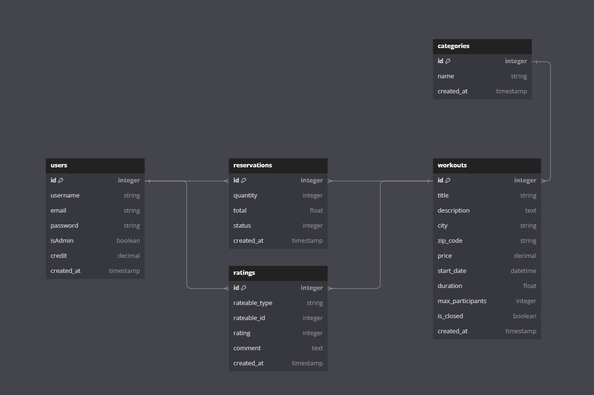

# KEELLA Back API



## Description

KEELLA Back API est une plateforme de location en ligne qui met en relation des personnes souhaitant louer des �quipements sportifs et des espaces pour pratiquer des activités sportives. Inspirée par le modéle d'Airbnb, elle se concentre spécifiquement sur le domaine sportif.

Les utilisateurs peuvent parcourir une variété d'équipements sportifs et d'espaces disponibles dans leur région ou dans un lieu qu'ils prévoient de visiter. Ils peuvent réserver et payer la location directement via l'application, offrant une commodité et une sécurité similaires à celles d'Airbnb.

De plus, les personnes qui possédent des équipements sportifs ou des espaces qu'elles n'utilisent pas tout le temps peuvent les inscrire sur l'application pour les louer à d'autres. C'est une excellente façon de monétiser ces ressources inutilisées.

En somme, votre application offre une solution pratique et économique pour les amateurs de sport, tout en créant une nouvelle source de revenus pour les propriétaires d'équipements et d'espaces sportifs.

## Fonctionnalit�s

- **Authentification des utilisateurs :** Connexion et inscription s�curis�es pour les utilisateurs et les administrateurs.
- **Annonces d'�quipements et d'espaces :** Parcourir et rechercher des �quipements sportifs et des espaces disponibles.
- **Syst�me de r�servation :** R�server et payer les locations directement via l'application.
- **Notes et avis :** Noter et commenter les �quipements et les espaces apr�s utilisation.
- **Panneau d'administration :** G�rer les utilisateurs, les r�servations et les annonces.

## Sch�ma de la base de donn�es

Le sch�ma de la base de donn�es inclut les tables suivantes :

- **users :** Stocke les informations des utilisateurs, y compris le nom d'utilisateur, l'email, le mot de passe, le statut d'administrateur et les cr�dits.
- **categories :** Stocke les catégories d'activités sportives.
- **workouts :** Stocke les informations sur les activit�s sportives disponibles, y compris le titre, la description, la ville, le code postal, le prix, la date de d�but, la dur�e, le nombre maximal de participants et le statut.
- **reservations :** Stocke les détails des réservations, y compris la quantité, le prix total, le statut et la date de création.
- **ratings :** Stocke les notes et commentaires des utilisateurs sur les activités sportives.

## Commencer

### Pr�requis

- Ruby 3.0.0
- Rails 7.0.0
- PostgreSQL

### Installation

1. Cloner le d�p�t

   ```shell
   git clone https://github.com/tommy-pellerin/back-keella.git
   cd back-keella
   ```

2. Installer les d�pendances

   ```shell
   bundle install
   ```

3. Configurer la base de donn�es

   ```shell
   rails db:create
   rails db:migrate
   ```

4. Lancer le serveur
   ```shell
   rails s
   ```

## Points de terminaison de l'API

#### - Authentification des utilisateurs

    -'POST /users' : Inscription d'un nouvel utilisateur.
    -'POST /users/sign_in' : Connexion d'un utilisateur existant.
    -'DELETE /users/sign_out' : Déconnexion de l'utilisateur actuellement connecté.

#### - Workouts

    -'GET /workouts' : Récupérer la liste des activités sportives.
    -'POST /workouts' : Créer une nouvelle activité sportive.
    -'GET /workouts/:id' : Récupérer les détails d'une activité sportive.
    -'PATCH /workouts/:id' : Mettre à jour les détails d'une activité sportive.
    -'DELETE /workouts/:id' : Supprimer une activité sportive.

#### - Reservations

    -'POST /reservations' : Créer une nouvelle réservation.
    -'GET /reservations/:id' : Récupérer les détails d'une réservation.

#### - Notes et avis

    -'POST /ratings' : Ajouter une note et un commentaire à une activité sportive.
    -'GET /ratings/:id' : Récupérer les notes et commentaires d'une activité sportive.

#### - Contact

Lien du projet : [Repo GitHub](https://github.com/tommy-pellerin/back-keella)

- [Tommy Pellerin](https://github.com/tommy-pellerin)
- [Alexis Brevier](https://github.com/BrvAlexis)
- [Loïc Le Crosnier-Terrancle](https://github.com/splmloic)
- [Winny Drancourt](https://github.com/WinnyDrancourt)
